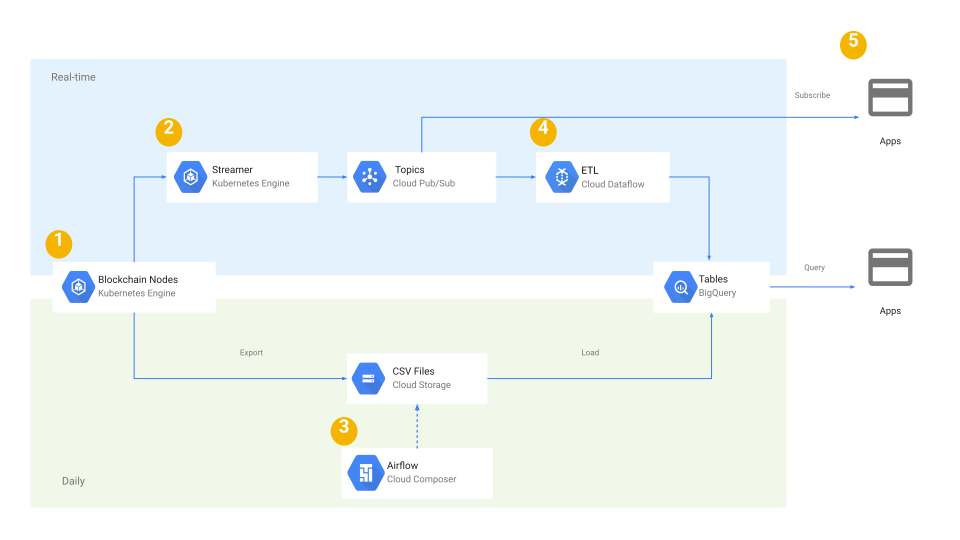

# 以太坊数据

目标：稳定的采集数据，保证数据的准确，最好可以速度也跟上。

how to fetch block data？how to do system design?

## 全节点建设和维护

【负责行情节点服务器等基础设施的管理和维护】

https://ethereum.org/zh/developers/docs/networks/

- chainstack 节点服务提供商
- 自建节点 -  https://docs.dappnode.io/

### 节点搭建

todo

### 节点监控

todo

### 测试节点的搭建

## 以太坊的gateway服务

【负责解析和获取实时区块数据，保证低延迟和高可用】

1. go版本： https://github.com/HydroProtocol/ethereum-jsonrpc-gateway
2. rust版本:  https://github.com/tomusdrw/jsonrpc-proxy

一个问题就是都是命令行的操作，如果将这个可视化，我认为是一个改进的方向。

开发一个支持多链的服务，方便数据的获取。 ->  实时获取数据保证低延迟。

## 以太坊的数据采集分析服务

【负责公司行情相关的研发开发，配合数据团队完成项目需求】

how to get data  and  how to analyze?

### 资料

- [Alethio](https://aleth.io/) - 一个先进的以太坊分析平台，提供实时监控，洞察和异常检测，令牌指标，智能合约审计，图形可视化和区块链搜索。还可以探索以太坊去中心化交易所的实时市场信息和交易活动。
- [amberdata.io](https://amberdata.io/) - 提供实时监控，洞察力和异常检测，令牌指标，智能合约审计，图形可视化和区块链搜索。
- [Neufund - Smart Contract Watch](https://github.com/Neufund/smart-contract-watch) - 一种监视大量智能合约和交易的工具
- [Scout](https://scout.cool/) - 以太坊上智能合约的活动和事件日志的实时数据馈送
- [Tenderly](https://tenderly.co/) - 一种平台，可通过Web仪表板的形式为用户提供可靠的智能合约监控和警报，而无需用户托管或维护基础架构
- [Chainlyt](https://www.chainlyt.io/main/dashboard/contract) - 使用已解码的交易数据探索智能合约，查看合约的使用方式以及通过特定功能调用搜索交易
- [BlockScout](https://github.com/poanetwork/blockscout) - 一种用于检查和分析基于EVM的区块链的工具。唯一以太坊网络的功能齐全的区块链浏览器。
- [Terminal](https://terminal.co/) - 用于监视dapp的控制面板。终端可用于监视用户，dapp，区块链基础设施，交易等。 infrastructure, transactions and more.
- [Ethereum-watcher](https://github.com/HydroProtocol/ethereum-watcher) - 用Golang编写的可扩展框架，用于侦听链上事件并做一些响应。

### 相同类型公司

他们有哪些？他们可以提供那些数据？他们是如果做的？我们可以学习些什么

### step 1 熟悉以太坊的`api`

以太坊`api`文档：

https://github.com/ethereum/execution-apis)

https://ethereum.github.io/execution-apis/api-documentation/

- `json-rpc`
- `graphQL`

### step 2 处理数据

#### 数据采集工具

数据监听工具：https://github.com/HydroProtocol/ethereum-watcher

合约监听工具：https://github.com/Neufund/smart-contract-watch

【合约监听工具】 https://github.com/vulcanize/eth-contract-watcher 

https://github.com/vulcanize

https://github.com/curvegrid/toy-block-explorer

【*谷歌的文章，必读】

https://cloud.google.com/blog/products/data-analytics/ethereum-bigquery-how-we-built-dataset

https://github.com/blockchain-etl/ethereum-etl-airflow

【区块链数据提取转换加载架构】

https://github.com/blockchain-etl/blockchain-etl-architecture

另一个etl的示例：【https://github.com/san089/goodreads_etl_pipeline】

采集工具2：https://github.com/wealdtech/chaind

#### 数据分析工具

https://github.com/JadeYeung/Solidity-utils

#### 数据推送工具

`kafka` `监控`

#### 数据分类

1. 网络数据

2. defi数据
3. 市场数据 market data
4. 喂价数据price feed

## 智能合约的开发

【负责智能合约的统计和分析等研发工作，解决各种疑难问题】

关于智能合约开发更新在个人网站中。

### 智能合约标准和类库

#### [ERCs](https://eips.ethereum.org/erc) - 以太坊评论提案库

- 代币
  - [ERC-20](https://eips.ethereum.org/EIPS/eip-20) - 同质化资产的原始代币合同
  - [ERC-721](https://eips.ethereum.org/EIPS/eip-721) - 非同质化资产的代币标准
  - [ERC-777](https://eips.ethereum.org/EIPS/eip-777) - 替代资产的改进令牌标准
  - [ERC-918](https://eips.ethereum.org/EIPS/eip-918) - 可采矿代币标准
- [ERC-165](https://eips.ethereum.org/EIPS/eip-165) - 创建一种标准方法来发布和检测智能合约实现的接口。
- [ERC-725](https://eips.ethereum.org/EIPS/eip-725) - 密钥管理和执行的代理合同，用于建立区块链身份。
- [ERC-173](https://eips.ethereum.org/EIPS/eip-173) - 合同所有权的标准接口

#### 流行的智能合约库

- [Zeppelin](https://github.com/OpenZeppelin/openzeppelin-contracts) - 包含经过测试的可重用智能合约，例如SafeMath和[OpenZeppelin SDK](https://github.com/OpenZeppelin/openzeppelin-sdk) 库，以实现智能合约的可升级性
- [cryptofin-solidity](https://github.com/cryptofinlabs/cryptofin-solidity) - 一组Solidity库，用于在以太坊上构建安全且节约Gas的智能合约。
- [Modular Libraries](https://github.com/Modular-Network/ethereum-libraries) -一组使用以太坊虚拟机在区块链上使用的软件包
- [DateTime Library](https://github.com/bokkypoobah/BokkyPooBahsDateTimeLibrary) - 节省Gas的Solidity日期和时间库
- [Aragon](https://github.com/aragon/aragon) - DAO协议。包含 [aragonOS smart contract framework](https://github.com/aragon/aragonOS) 智能合约框架，重点关注可升级性和治理
- [ARC](https://github.com/daostack/arc) - DAO和DAO堆栈基础层的操作系统。
- [0x](https://github.com/0xProject) - DEX协议
- [Token Libraries with Proofs](https://github.com/sec-bit/tokenlibs-with-proofs) - 包含令牌合同的正确性证明。给定的规格和高级属性
- [Provable API](https://github.com/provable-things/ethereum-api) - 提供使用Provable服务的合同，允许进行链下操作，数据获取和计算
- [ABDK Libraries for Solidity](https://github.com/abdk-consulting/abdk-libraries-solidity) - 用于Solidity的定点（64.64位）和IEEE-754兼容四精度（128位）浮点数学库

##### 智能合约开发的模式

- Dappsys：安全，简单和灵活的以太坊合约构建模块
  - 有针对以太坊/Solidity常见问题的解决方案，例如。
    - [白名单](https://steemit.com/ethereum/@nexusdev/dapp-a-day-11-whitelist-boring)
    - [可升级的ERC20代币](https://steemit.com/ethereum/@nikolai/dapp-a-day-6-upgradeable-tokens)
    - [ERC20-令牌库](https://steemit.com/ethereum/@nexusdev/dapp-a-day-18-erc20-token-vault)
    - [验证（RBAC）](https://steemit.com/ethereum/@nikolai/dapp-a-day-4-access-control-via-auth)
    - [...更多...](https://github.com/dapphub/dappsys)
  - 为[MakerDAO](https://github.com/makerdao/maker-otc)或[The TAO](https://github.com/ryepdx/the-tao)提供构建块
  - 在创建自己的未经测试的解决方案之前，应咨询该公司
  - [Dapp-a-day 1-10](https://steemit.com/@nikolai) 和 [Dapp-a-day 11-25](https://steemit.com/@nexusdev)中描述了用法
- OpenZeppelin合同：以Solidity语言编写的可重用和安全智能合同的开放框架。
  - 可能是使用最广泛的安全库和智能合约库
  - 与Dappsys相似，更多地集成到Truffle框架中了
  - [有关安全审核最佳做法的博客](https://blog.openzeppelin.com/)
- [装配高级车间](https://github.com/androlo/solidity-workshop)
- [更简单的以太坊Multisig](https://medium.com/@ChrisLundkvist/exploring-simpler-ethereum-multisig-contracts-b71020c19037) - 特点是 *Benefits*
- [CryptoFin Solidity审核清单](https://github.com/cryptofinlabs/audit-checklist) - 常见发现清单，以及审核主网启动合同时要注意的问题。
- aragonOS：用于构建DAO，Dapp和协议的智能合约框架
  - 可升级性：智能合约可以升级到新版本
  - 权限控制：通过使用`auth`和`authP`修饰符，您可以保护功能，以便只有其他应用或实体才能访问它
  - 转发器：aragonOS应用程序可以将其执行操作的意图发送给其他应用程序，以便在满足一组要求的情况下转发意图
- EIP-2535钻石标准
  - 组织合同，使它们共享相同的合同存储和以太坊地址。
  - 解决最大24KB的合同大小限制。
  - 通过在单个事务中添加/替换/删除任意数量的功能来升级钻石。
  - 通过使用标准事件记录升级，透明性是透明的。
  - 获取有关具有事件和/或四个标准功能的钻石的信息。
